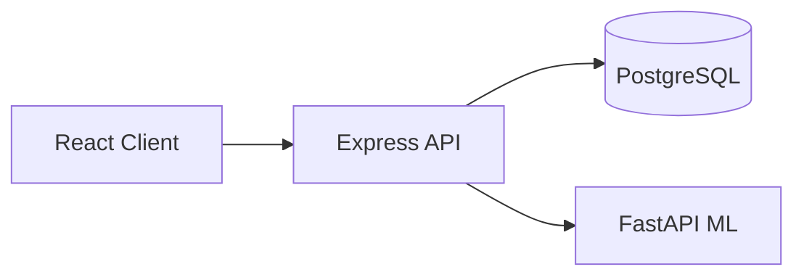

# Inteligentni informacioni sistem za organizaciju muzičkih nastupa i događaja primenom mašinskog učenja

Monorepo prototip full-stack veb aplikacije za master rad — povezivanje organizatora muzičkih događaja sa odgovarajućim izvođačima pomoću modela mašinskog učenja.

## Funkcionalnosti

- Upravljanje korisnicima (Administrator, Organizator, Izvođač), promena lozinke
- Kreiranje i upravljanje muzičkim događajima
- Prijave, pozivi, zakazivanje i upravljanje nastupima (status, izmena termina)
- ML preporuke izvođača na osnovu karakteristika događaja
- Ocenjivanje izvođača posle završenog nastupa i automatsko preračunavanje prosečne ocene
- Notifikacije (zvonce u navigaciji, označavanje pročitanog)
- Dashboard-i i statistika po ulogama

## Tehnološki stek

| Sloj | Tehnologije |
|------|-------------|
| Frontend | React, TypeScript, Vite, React Router, TanStack Query, Tailwind CSS |
| Backend | Node.js, Express, TypeScript, Prisma, PostgreSQL, JWT |
| ML servis | Python, FastAPI, scikit-learn, pandas |
| Infrastruktura | Docker, Docker Compose |

## Arhitektura



## Struktura projekta

```
/client          — React frontend
/server          — Node.js REST API
/ml-service      — Python ML servis
/docs            — Dokumentacija za master rad (13 fajlova)
docker-compose.yml
.env.example
```

## Zahtevi

- Node.js 20+
- npm 10+
- Python 3.11+
- Docker & Docker Compose (opciono)
- PostgreSQL 16 (lokalno ili preko Docker-a)

## Brzo pokretanje (Docker Compose)

```bash
cp .env.example .env
docker compose up --build

# Frontend: http://localhost:5173
# Backend:  http://localhost:3001
# ML API:   http://localhost:8000
```

Nakon prvog pokretanja:

```bash
docker compose exec server npx prisma migrate deploy
docker compose exec server npm run db:seed
```

## Lokalno pokretanje (bez Docker-a)

### 1. PostgreSQL

```bash
docker compose up postgres -d
```

### 2. Backend

```bash
cd server
cp .env.example .env
npm install
npx prisma generate
npx prisma migrate deploy
npm run db:seed
npm run dev
```

### 3. ML servis

```bash
cd ml-service
python -m venv .venv
.venv\Scripts\activate          # Windows
pip install -r requirements.txt
uvicorn app.main:app --reload --port 8000
```

### 4. Frontend

```bash
cd client
cp .env.example .env
npm install
npm run dev
```

## Test nalozi (demonstracioni)

> **Napomena:** Demonstracione lozinke — ne koristiti u produkciji.

| Uloga | Email | Lozinka |
|-------|-------|---------|
| Administrator | `admin@demo.local` | `DemoAdmin123!` |
| Organizator | `organizer1@demo.local` | `DemoOrg123!` |
| Izvođač | `artist1@demo.local` | `DemoArtist123!` |

Seed kreira: 1 admin, 6 organizatora, 55 izvođača, 35 događaja, prijave, nastupe, ocene i preporuke.

## Treniranje modela

```bash
cd ml-service
python scripts/generate_synthetic_data.py
python scripts/preprocess_data.py
python scripts/train_model.py
python scripts/evaluate_model.py
```

**Najbolji model:** Gradient Boosting v1.0.0 (F1 ≈ 0.784, ROC AUC ≈ 0.714) na sintetičkim podacima.

## Testovi

```bash
cd server && npm test      # 18 passed (5 od njih se preskaču ako PostgreSQL nije dostupan)
cd ml-service && pytest    # 13 passed
cd client && npm test       # 6 passed
cd client && npm run build  # TypeScript + production build
```

## Dokumentacija

Kompletna dokumentacija za master rad nalazi se u [`/docs`](./docs/README.md):

- Pregled projekta, definicija problema, zahtevi
- Use case i arhitektura (Mermaid dijagrami)
- Dizajn baze, API, ML metodologija
- Testiranje, deployment, ograničenja

## Poznata ograničenja

- ML dataset je **sintetički** — samo za prototip
- Auth integracioni testovi zahtevaju pokrenut PostgreSQL
- Nema E2E testova ni produkcijskog HTTPS-a

## Licenca

Projekat za akademske svrhe — master rad.
