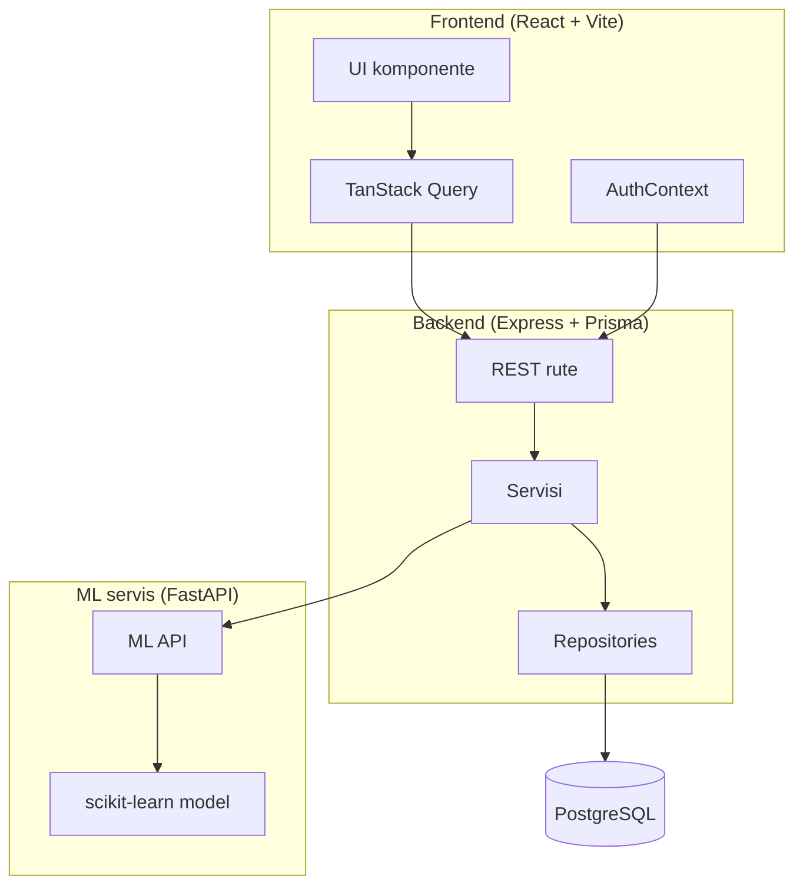
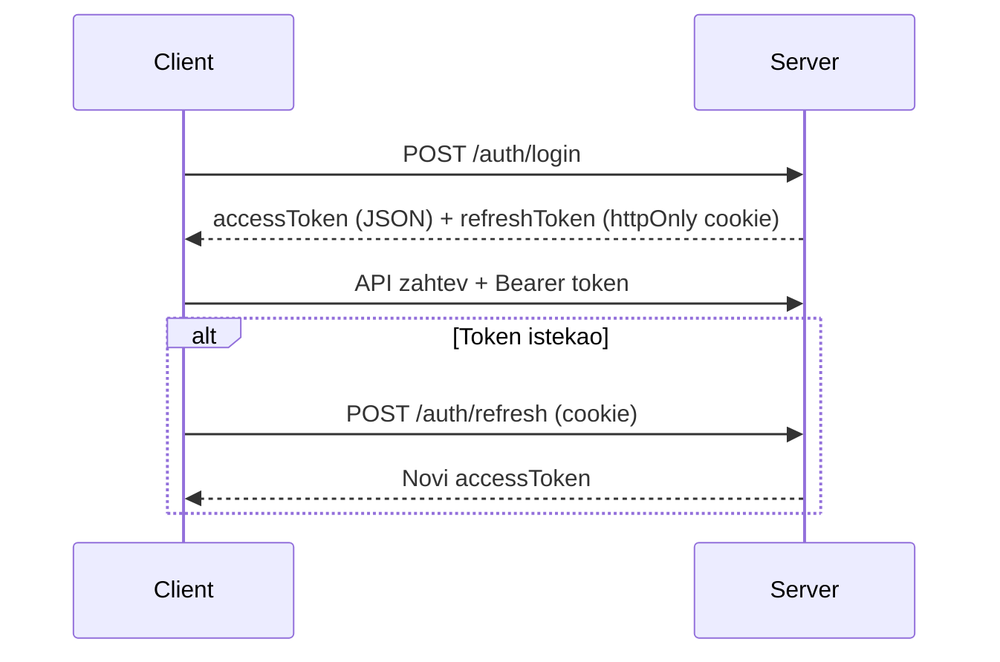
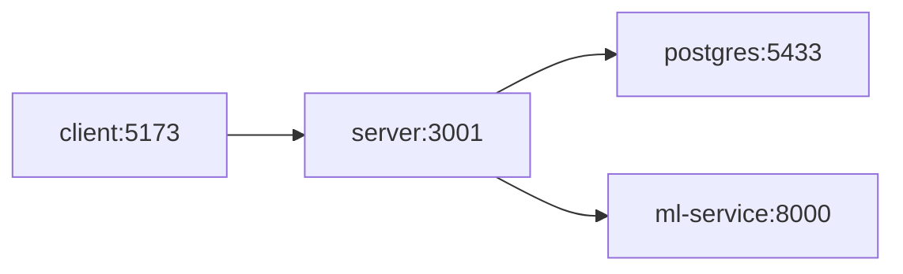

# Arhitektura sistema

## Visokonivojski pregled



## Slojevita arhitektura (backend)

```
routes/          → HTTP endpoint definicije
controllers/     → Parsiranje zahteva, poziv servisa
services/        → Poslovna logika
repositories/    → Pristup bazi (auth)
middleware/      → Auth, validacija, error handling
schemas/         → Zod šeme
utils/           → Pomoćne funkcije (JWT, scheduleConflict, mlPayload)
```

## Komunikacija između servisa

| Od | Do | Protokol | Svrha |
|----|-----|----------|-------|
| Client | Server | HTTPS/HTTP REST | CRUD, auth |
| Server | ML Service | HTTP REST | predict, recommend, train |
| Server | PostgreSQL | Prisma ORM | Perzistencija |

## Autentifikacija



## ML integracija

1. `recommendation.service.ts` učitava događaj i listu izvođača iz baze (**samo tip koji odgovara `preferredArtistType`**)
2. `mlPayload.ts` mapira entitete u feature vektor
3. `mlClient.service.ts` poziva FastAPI sa retry i timeout logikom
4. **Post-processing na serveru:** model daje žanru relativno nizak feature importance (~9%, v. `model_metadata.json`), pa se ML skor pre čuvanja koriguje faktorom zasnovanim na stvarnom podudaranju žanra (`score × (0.5 + 0.5 × genreMatch)`), tako da izvođači bez ijednog zajedničkog žanra ne mogu nadmašiti one koji se poklapaju samo zahvaljujući drugim karakteristikama
5. Rezultati se čuvaju u tabeli `Recommendation`

## Frontend arhitektura

```
pages/           → Stranice po ulozi (public, auth, organizer, artist, admin)
components/      → Reusable UI (Navbar, EventCard, ProtectedRoute...)
context/         → AuthContext (globalno stanje korisnika)
lib/api.ts       → Axios instanca + interceptors
types/           → TypeScript interfejsi
```

## Bezbednosni sloj

- **Helmet** — HTTP security headers
- **CORS** — ograničen origin
- **Rate limiting** — auth rute (20 req / 15 min)
- **bcrypt** — hash lozinki
- **Zod** — validacija ulaznih podataka
- **authorize()** — provera uloge na rutama

## Docker Compose topologija



Svi servisi dele `.env` konfiguraciju iz `.env.example`.
