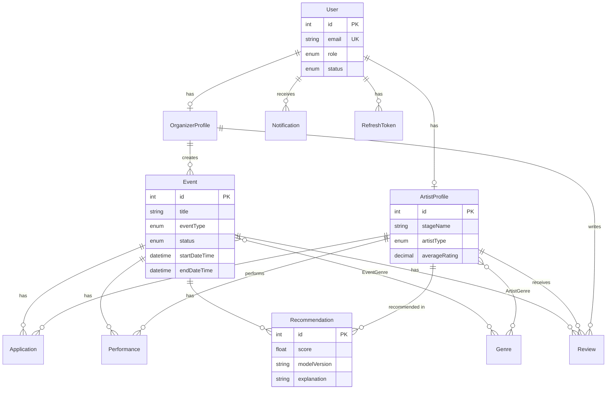

# Dizajn baze podataka

## ER dijagram



## Glavni entiteti

### User

Centralni entitet za autentifikaciju. Svaki korisnik ima tačno jednu ulogu: `ADMIN`, `ORGANIZER` ili `ARTIST`.

### OrganizerProfile / ArtistProfile

Proširenja profila po ulozi. Organizator ima `organizationName`, izvođač `stageName`, `biography`, `minimumFee`, `maximumFee`, itd.

### Event

Događaj sa tipom (`CONCERT`, `FESTIVAL`, ...), statusom (`DRAFT`, `PUBLISHED`, `CANCELLED`, `COMPLETED`), vremenskim intervalom i budžetom.

### Application

Veza izvođač–događaj. Tip: `APPLY` (prijava) ili `INVITE` (poziv). Status: `PENDING`, `ACCEPTED`, `REJECTED`, ...

### Performance

Potvrđen nastup sa `startDateTime`, `endDateTime`, `agreedFee` i statusom.

### Recommendation

ML preporuka sa `score`, `modelVersion` i `explanation` (JSON tekst).

### Review

Ocena izvođača (1–5) koju organizator ostavlja za konkretan događaj, uz opcioni komentar. Dozvoljena samo ako izvođač ima nastup sa statusom `COMPLETED` na tom događaju; jedna ocena po paru (event, izvođač) — `@@unique([eventId, artistId])`. Svako kreiranje ponovo preračunava `averageRating` na `ArtistProfile` kao prosek svih ocena tog izvođača.

### Notification

Poruka korisniku (naslov, tekst, `isRead`) generisana pri ključnim akcijama (nova prijava, promena statusa, zakazan nastup). Prikazuje se kroz zvonce u navigaciji.

## Indeksi

| Tabela | Indeks | Svrha |
|--------|--------|-------|
| User | role, status | Filtriranje korisnika |
| Event | organizerId, status, startDateTime | Lista događaja |
| Application | eventId, artistId, status | Prijave po događaju |
| Performance | artistId, startDateTime | Konflikt termina |
| Recommendation | eventId, score | Rangiranje preporuka |

## Enumeracije

```
UserRole:        ADMIN | ORGANIZER | ARTIST
EventStatus:     DRAFT | PUBLISHED | CANCELLED | COMPLETED
ApplicationType: APPLY | INVITE
ApplicationStatus: PENDING | ACCEPTED | REJECTED | WITHDRAWN | CANCELLED
PerformanceStatus: SCHEDULED | CONFIRMED | COMPLETED | CANCELLED
```

## Seed podaci

Skripta `server/prisma/seed.ts` kreira:

| Entitet | Broj |
|---------|------|
| Admin | 1 |
| Organizatori | 6 |
| Izvođači | 55 |
| Događaji | 35 |
| Prijave, nastupi, ocene, preporuke | — |

## Migracije

```
server/prisma/migrations/20260713180000_init/
server/prisma/migrations/20260901120000_refresh_token_used_at/   # usedAt na RefreshToken — detekcija ponovne upotrebe pri refresh-u
```

Pokretanje:

```bash
cd server
npx prisma migrate deploy
npm run db:seed
```
