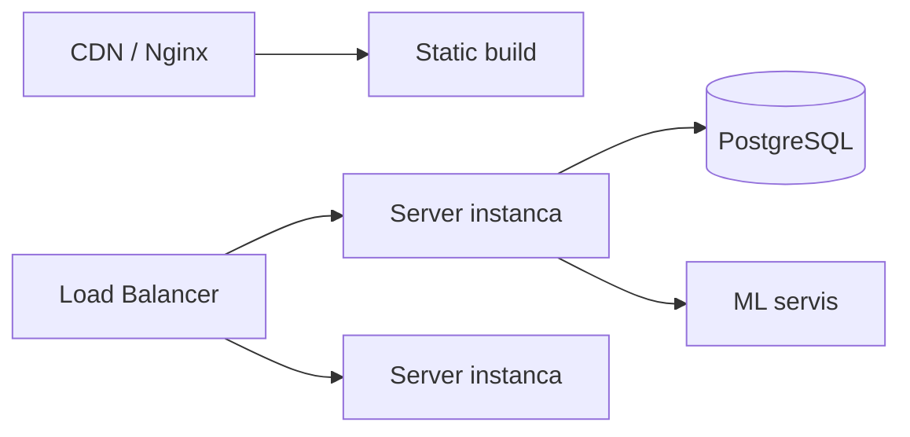

# Deployment

## Opcije pokretanja

1. **Docker Compose** — svi servisi odjednom (preporučeno za demo)
2. **Lokalno** — svaki servis posebno (razvoj)

## Docker Compose

```bash
cp .env.example .env
docker compose up --build
```

| Servis | URL |
|--------|-----|
| Frontend | http://localhost:5173 |
| Backend | http://localhost:3001 |
| ML API | http://localhost:8000 |
| PostgreSQL | localhost:5433 |

### Inicijalizacija baze (prvi put)

```bash
docker compose exec server npx prisma migrate deploy
docker compose exec server npm run db:seed
```

## Lokalno pokretanje

### 1. PostgreSQL

```bash
docker compose up postgres -d
```

Ili lokalna instalacija PostgreSQL 16 sa bazom iz `.env.example`.

### 2. Backend

```bash
cd server
cp .env.example .env
npm install
npx prisma generate
npx prisma migrate deploy
npm run db:seed
npm run dev
```

### 3. ML servis

```bash
cd ml-service
python -m venv .venv
.venv\Scripts\activate        # Windows
pip install -r requirements.txt
uvicorn app.main:app --reload --port 8000
```

Model mora postojati (`models/best_model.joblib`). Ako ne postoji:

```bash
python scripts/prepare_real_dataset.py
python scripts/preprocess_data.py
python scripts/train_model.py
python scripts/build_genre_popularity.py
```

### 4. Frontend

```bash
cd client
cp .env.example .env
npm install
npm run dev
```

## Environment varijable

Ključne promenljive (v. `.env.example`):

| Promenljiva | Servis | Opis |
|-------------|--------|------|
| `DATABASE_URL` | Server | PostgreSQL connection string |
| `JWT_ACCESS_SECRET` | Server | JWT tajna (min 32 znaka) |
| `JWT_REFRESH_SECRET` | Server | Refresh token tajna |
| `CORS_ORIGIN` | Server | Frontend URL |
| `ML_SERVICE_URL` | Server | URL ML servisa |
| `VITE_API_URL` | Client | Backend API URL |
| `ML_MODEL_PATH` | ML | Putanja do modela |

## Produkcijski deployment — Vercel + Render

Konkretan, besplatan način da se prototip objavi online:

| Deo | Platforma | Napomena |
|-----|-----------|----------|
| `client` | Vercel | `vercel.json` u `client/` već ima SPA rewrite pravilo |
| `server` | Render (Web Service, Node) | Build: `npm install && npx prisma generate && npm run build` · Start: `npx prisma migrate deploy && npm start` |
| `ml-service` | Render (Web Service, Python) | Build: `pip install -r requirements.txt` · Start: `uvicorn app.main:app --host 0.0.0.0 --port $PORT` |
| Baza | Render Postgres, ili Neon/Supabase (trajno besplatan tier) | Render-ov besplatan Postgres ističe posle 30 dana |

Redosled (zbog međuzavisnih URL-ova):

1. Deploy baze → dobiti `DATABASE_URL`
2. Deploy `ml-service` na Render → dobiti javni URL
3. Deploy `server` na Render, sa `DATABASE_URL` i `ML_SERVICE_URL` (iz koraka 1–2); `CORS_ORIGIN` privremeno ostaviti prazan/localhost
4. Deploy `client` na Vercel, sa `VITE_API_URL` = URL servera iz koraka 3
5. Vratiti se na server i postaviti `CORS_ORIGIN` na pravi Vercel URL, redeploy

Pošto su client i server na različitim domenima, refresh-token kolačić mora biti `sameSite:'none'` u produkciji — ovo je već uslovljeno na `NODE_ENV=production` u `auth.controller.ts`.

## Produkcijski deployment (preporuke)



- Frontend: `npm run build` → serviranje `dist/` preko Nginx-a
- Backend: Node.js PM2 ili Docker kontejner
- ML: Docker kontejner sa učitanim modelom
- Baza: managed PostgreSQL (RDS, Supabase, ...)
- HTTPS: reverse proxy (Nginx, Traefik)
- Tajne: environment varijable, ne u git-u

## Health check-ovi

| Servis | Endpoint |
|--------|----------|
| Server | `GET /api/health` |
| ML | `GET /health` |

Docker Compose koristi ove endpoint-e za `healthcheck` konfiguraciju.

## Poznati problemi pri deployment-u

- **Docker Desktop** mora biti pokrenut na Windows-u
- **Port 8000** — proveriti da nije zauzet od strane druge ML instance
- **DB kredencijali** — moraju se poklapati između `.env` i Docker Compose-a
- **Port 5433 zauzet / "authentication failed" pri `prisma migrate deploy`** — ako lokalna mašina već ima instaliran nativni PostgreSQL koji sluša na 5432 (ili 5433), Docker kontejner ga neće "prekriti" već će konekcija otići na pogrešan server. Rešenje: promeniti `POSTGRES_PORT` u root `.env` na slobodan port i ponovo pokrenuti `docker compose up postgres -d` (rekreira kontejner sa novim mapiranjem), a ne dirati nepoznati postojeći proces.
