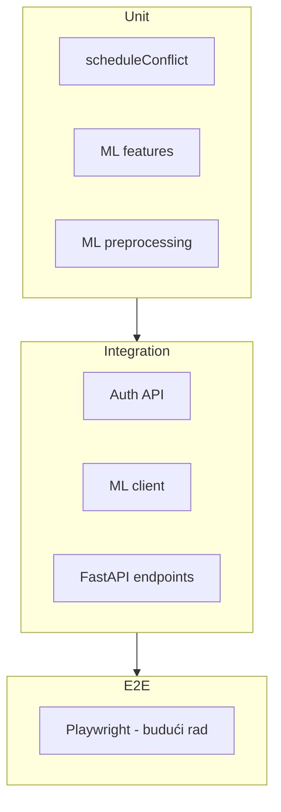

# Testiranje

## Pregled

| Sloj | Alat | Lokacija | Testova |
|------|------|----------|---------|
| Server | Vitest + Supertest | `server/src/test/` | 30 (5 od njih zahtevaju pokrenut PostgreSQL, inače se preskaču) |
| ML servis | pytest | `ml-service/tests/` | 30 |
| Client | Vitest + Testing Library | `client/src/test/` | 12 |

## Pokretanje svih testova

```bash
cd server && npm test
cd ml-service && pytest
cd client && npm test
```

## Server testovi

### `sanity.test.ts`
Osnovna provera Vitest okruženja.

### `scheduleConflict.test.ts`
Unit testovi za `utils/scheduleConflict.ts`:
- Detekcija preklapanja termina
- Granični slučajevi (tačno na granici, bez preklapanja)

### `auth.test.ts`
Integracioni testovi auth API-ja (zahtevaju PostgreSQL + seed):
- Login sa seed nalogom
- `/auth/me` sa tokenom
- Odbijanje nevažećeg tokena

> **Napomena:** Testovi se automatski preskaču (`skipIf`) ako baza nije dostupna.

### `ml.integration.test.ts`
Testovi `mlClient.service.ts`:
- Timeout i retry logika
- 503 kada ML servis nije dostupan
- Mapiranje odgovora

### `authRefresh.test.ts`
Unit testovi za `auth.service.ts` (mock `refreshTokenRepository`, bez baze):
- Reuse refresh tokena unutar 10s prozora tolerancije izdaje nove tokene bez brisanja sesija
- Reuse van tog prozora briše sve sesije korisnika i baca 401
- Normalan (prvi) refresh označava token kao iskorišćen
- Istekao token se briše i odbija

### `performanceService.test.ts`
Unit testovi za `performance.service.ts` (mock Prisma/notification servis):
- Blokira izmenu termina/honorara i reaktivaciju otkazanog nastupa nakon što se događaj završi
- Označavanje nastupa kao COMPLETED i dalje radi nakon završetka događaja
- Izmena i dalje radi dok je događaj aktivan

### `eventService.test.ts`
Unit testovi za `event.service.ts` (mock Prisma transakcija/notification servis):
- Otkazivanje događaja kaskadno otkazuje PENDING/ACCEPTED prijave i SCHEDULED/CONFIRMED nastupe
- Svaki pogođeni izvođač dobija tačno jedno obaveštenje (deduplikacija proverena)
- Ne diraju se prijave/nastupi pri običnom ažuriranju ili pokušaju izmene statusa već otkazanog događaja

## ML servis testovi

### `test_preprocessing.py`
- Učitavanje i čišćenje podataka
- Pipeline fit/predict
- Stratified split

### `test_features.py`
- Feature engineering funkcije

### `test_api.py`
- FastAPI endpoint-i (`/health`, `/predict`, `/recommend`)
- Validacija ulaznih podataka

### `test_predictor.py`
Testovi za formulu rangiranja preporuka i oba realna signala (direktno određuju šta
korisnik vidi kao preporuku, ranije bez pokrivenosti):
- `compute_genre_popularity` — fallback ponašanje (nepoznat žanr, nedostajući `_default`, normalizacija velikih/malih slova, prosek za više žanrova)
- `compute_event_type_fit` — isto za lokalni signal, uz neutralan fallback na 0.5 kad nema dovoljno lokalnih podataka
- `ModelService._score_pair` — ponderisana suma prema `SCORE_WEIGHTS` (uklj. proveru da težine zbirno daju 1.0), savršen i najgori slučaj
- `ModelService.recommend` — sortiranje po skoru, prazna lista izvođača

### `test_sanity.py`
Osnovna provera pytest okruženja.

## Client testovi

### `sanity.test.ts`
Osnovna provera.

### `loginPage.test.tsx`
- Renderovanje login forme
- Polja email/lozinka i dugme za prijavu

### `protectedRoute.test.tsx`
- Preusmerenje neautentifikovanog korisnika na login
- Prikaz sadržaja za odgovarajuću ulogu

### `api.test.ts`
- `getErrorMessage` helper za Axios i generičke greške

### `registerPage.test.tsx`
- Regresioni test: greška validacije se prikazuje za svako obavezno polje pri praznoj predaji (ranije se prikazivala samo za lozinku)
- Labele su povezane sa poljima preko `htmlFor`/`id`
- Uslovna polja (umetničko ime/tip izvođača) se menjaju sa ulogom

### `navbar.test.tsx`
- Mobilni meni: zatvoren podrazumevano, otvara se na klik i prikazuje linkove specifične za ulogu
- Zatvara se na Escape i na klik na link, uz ispravan `aria-expanded`

## Strategija testiranja



## Pokrivene oblasti

| Oblast | Pokrivenost |
|--------|-------------|
| Auth logika | ✅ (sa DB) |
| Refresh-token reuse/bezbednost | ✅ (unit, bez DB) |
| Schedule conflict | ✅ |
| Životni ciklus događaja/nastupa (kaskadno otkazivanje, zaključavanje nakon isteka) | ✅ (unit, bez DB) |
| ML pipeline | ✅ |
| ML API | ✅ |
| ML formula rangiranja i oba realna signala (genre_popularity, event_type_fit) | ✅ |
| ML client integracija | ✅ |
| Frontend auth/rute | ✅ |
| Frontend forme (validacija, labele) | ✅ |
| Frontend mobilna navigacija | ✅ |
| CRUD API | ⚠️ Delimično (kroz seed + manuelno) |
| Pristupačnost (WCAG) — manuelno čitačem ekrana | ⚠️ Scenariji napisani (`accessibility-testing-scenarios.md`), izvođenje u toku |
| E2E UI | ❌ Nije implementirano |

## CI preporuka

```yaml
# Primer GitHub Actions koraka
- run: cd server && npm test
- run: cd ml-service && pip install -r requirements.txt && pytest
- run: cd client && npm test
- run: cd client && npm run build
```

Za integracione auth testove potreban je PostgreSQL servis u CI okruženju.
