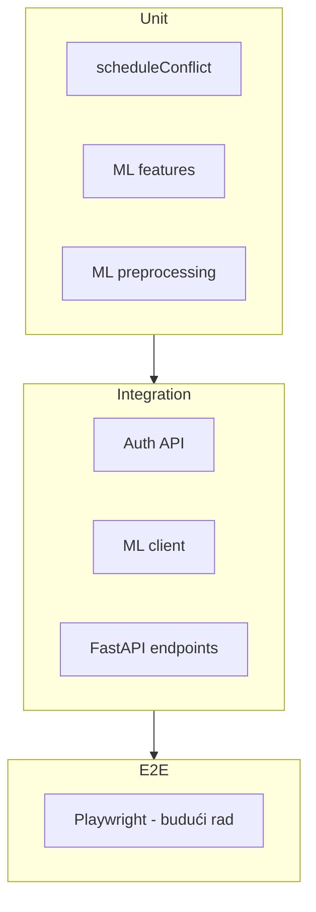

# Testiranje

## Pregled

| Sloj | Alat | Lokacija | Testova |
|------|------|----------|---------|
| Server | Vitest + Supertest | `server/src/test/` | 18 (5 od njih zahtevaju pokrenut PostgreSQL, inače se preskaču) |
| ML servis | pytest | `ml-service/tests/` | 13 |
| Client | Vitest + Testing Library | `client/src/test/` | 6 |

## Pokretanje svih testova

```bash
cd server && npm test
cd ml-service && pytest
cd client && npm test
```

## Server testovi

### `sanity.test.ts`
Osnovna provera Vitest okruženja.

### `scheduleConflict.test.ts`
Unit testovi za `utils/scheduleConflict.ts`:
- Detekcija preklapanja termina
- Granični slučajevi (tačno na granici, bez preklapanja)

### `auth.test.ts`
Integracioni testovi auth API-ja (zahtevaju PostgreSQL + seed):
- Login sa seed nalogom
- `/auth/me` sa tokenom
- Odbijanje nevažećeg tokena

> **Napomena:** Testovi se automatski preskaču (`skipIf`) ako baza nije dostupna.

### `ml.integration.test.ts`
Testovi `mlClient.service.ts`:
- Timeout i retry logika
- 503 kada ML servis nije dostupan
- Mapiranje odgovora

## ML servis testovi

### `test_preprocessing.py`
- Učitavanje i čišćenje podataka
- Pipeline fit/predict
- Stratified split

### `test_features.py`
- Feature engineering funkcije

### `test_api.py`
- FastAPI endpoint-i (`/health`, `/predict`, `/recommend`)
- Validacija ulaznih podataka

### `test_sanity.py`
Osnovna provera pytest okruženja.

## Client testovi

### `sanity.test.ts`
Osnovna provera.

### `loginPage.test.tsx`
- Renderovanje login forme
- Polja email/lozinka i dugme za prijavu

### `protectedRoute.test.tsx`
- Preusmerenje neautentifikovanog korisnika na login
- Prikaz sadržaja za odgovarajuću ulogu

### `api.test.ts`
- `getErrorMessage` helper za Axios i generičke greške

## Strategija testiranja



## Pokrivene oblasti

| Oblast | Pokrivenost |
|--------|-------------|
| Auth logika | ✅ (sa DB) |
| Schedule conflict | ✅ |
| ML pipeline | ✅ |
| ML API | ✅ |
| ML client integracija | ✅ |
| Frontend auth/rute | ✅ |
| CRUD API | ⚠️ Delimično (kroz seed + manuelno) |
| E2E UI | ❌ Nije implementirano |

## CI preporuka

```yaml
# Primer GitHub Actions koraka
- run: cd server && npm test
- run: cd ml-service && pip install -r requirements.txt && pytest
- run: cd client && npm test
- run: cd client && npm run build
```

Za integracione auth testove potreban je PostgreSQL servis u CI okruženju.
