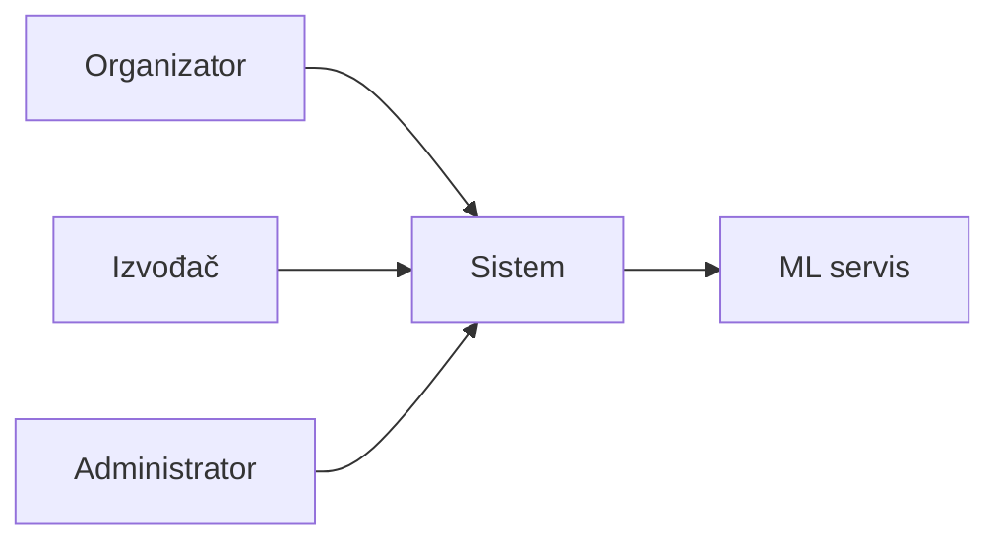
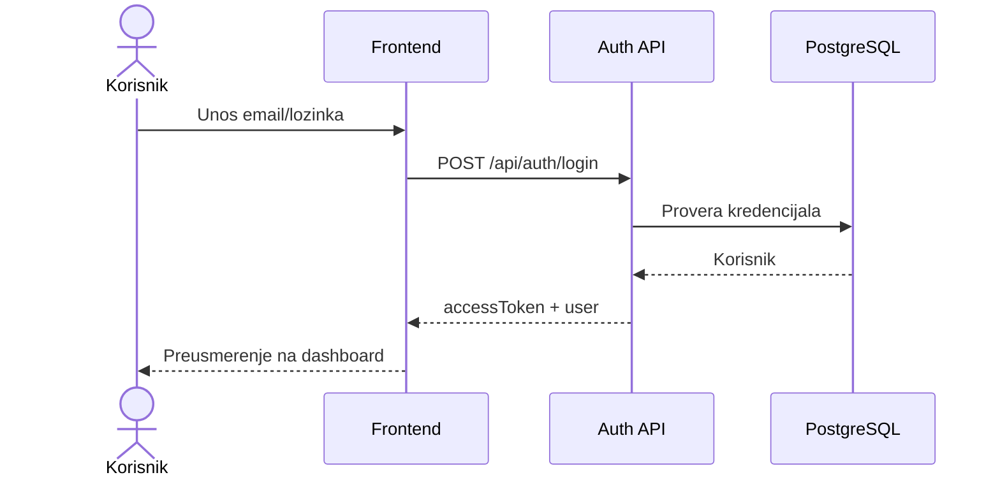
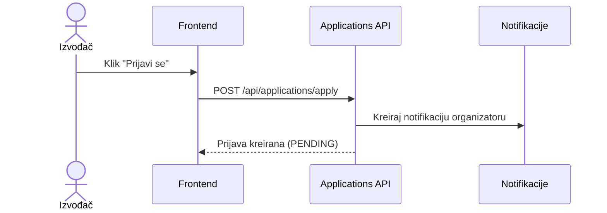
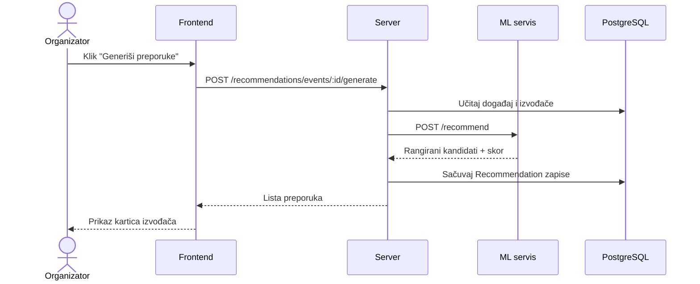

# Use case dijagrami

## Pregled aktera

## UC-01: Registracija i prijava

## UC-02: Kreiranje događaja

| Polje | Vrednost |
|-------|----------|
| Akter | Organizator |
| Preduslov | Prijavljen korisnik sa ulogom ORGANIZER |
| Tok | 1. Otvara formu 2. Popunjava podatke 3. Bira žanrove 4. Čuva (DRAFT/PUBLISHED) |
| Postuslov | Događaj sačuvan u bazi |

## UC-03: Prijava izvođača na događaj

## UC-04: Generisanje ML preporuka

## UC-05: Upravljanje nastupima

| Korak | Akcija |
|-------|--------|
| 1 | Organizator prihvata prijavu (na pojedinačnom događaju ili u objedinjenom pregledu „Prijave“) |
| 2 | Organizator zakazuje nastup — bira termin i honorar |
| 3 | Provera konflikta termina (izvođač i događaj) |
| 4 | Izvođač vidi nastup na stranici „Moji nastupi“ |
| 5 | Organizator menja status nastupa (SCHEDULED → CONFIRMED → COMPLETED, ili CANCELLED) |
| 6 | Nastup sa statusom COMPLETED se više ne može obrisati niti vratiti u prethodni status |

## UC-06: Ocenjivanje izvođača

| Polje | Vrednost |
|-------|----------|
| Akter | Organizator |
| Preduslov | Izvođač ima nastup sa statusom COMPLETED na tom događaju |
| Tok | 1. Organizator otvara stranicu događaja 2. Bira ocenu (1–5) i opcioni komentar 3. Sistem sprečava duplu ocenu za isti par (event, izvođač) |
| Postuslov | Review zapis sačuvan; `averageRating` izvođača se automatski preračunava |

## UC-07: Notifikacije

- Sistem kreira notifikaciju korisniku pri ključnim akcijama (nova prijava/poziv, promena statusa prijave, zakazan nastup)
- Korisnik vidi broj nepročitanih na zvoncu u navigaciji
- Otvaranjem/klikom označava pojedinačnu ili sve notifikacije kao pročitane

## UC-08: Promena lozinke

- Bilo koja uloga (Admin, Organizator, Izvođač) menja lozinku sa stranice „Podešavanja“
- Sistem proverava trenutnu lozinku pre upisa nove
- Sve postojeće sesije (refresh tokeni) se poništavaju nakon promene

## UC-09: Administracija korisnika

- Administrator pregleda listu korisnika
- Menja status naloga — ACTIVE / BLOCKED / INACTIVE (`PATCH /api/users/:id/status`)
- Otvara profil izvođača/organizatora vezan za nalog (uključujući blokirane naloge)
- Pregleda ML metrike na admin dashboard-u

## Matrica use case–uloga

| Use case | Admin | Organizator | Izvođač |
|----------|:-----:|:-----------:|:-------:|
| Prijava/registracija | ✓ | ✓ | ✓ |
| CRUD događaji | ✓ | ✓ | — |
| Prijave/pozivi | — | ✓ | ✓ |
| ML preporuke | — | ✓ | — |
| Kalendar i upravljanje nastupima | — | ✓ | — |
| Ocenjivanje izvođača | — | ✓ | — |
| Notifikacije | ✓ | ✓ | ✓ |
| Promena lozinke | ✓ | ✓ | ✓ |
| Upravljanje korisnicima | ✓ | — | — |
| ML model nadzor | ✓ | — | — |
